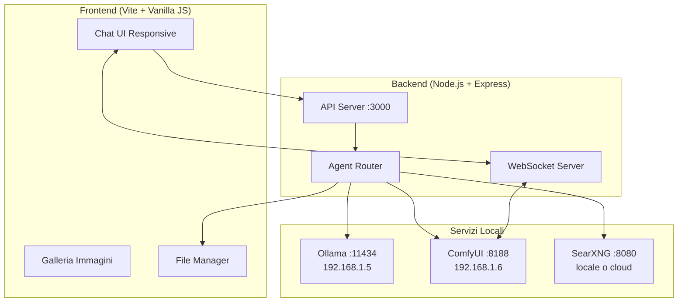
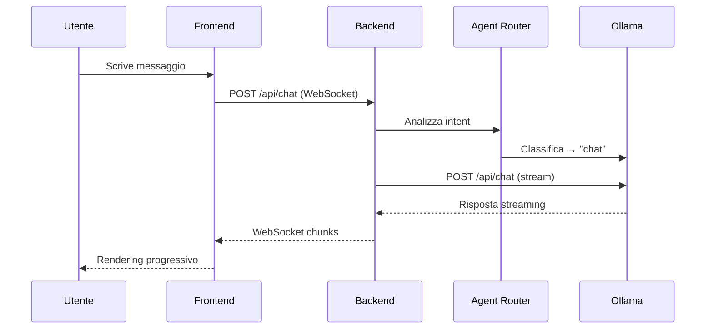
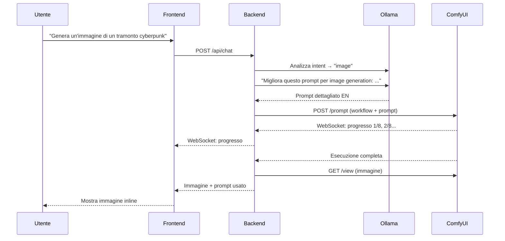
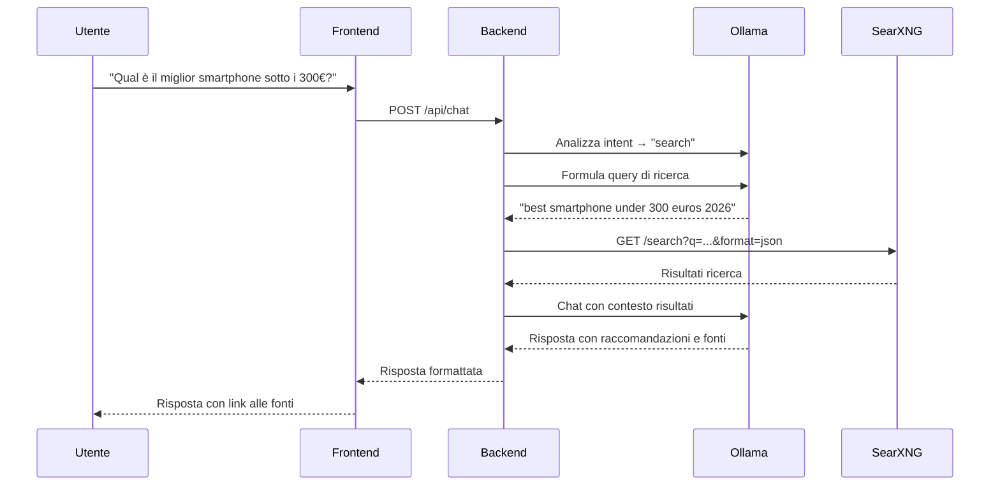

# LocalAI Chat — App di Chat con LLM Locale

Un'applicazione web completa per chattare con LLM locale (Ollama), generare immagini (ComfyUI), cercare sul web (SearXNG/Brave), e gestire file/media del dispositivo. Responsive per PC e mobile.

## Architettura Generale



## User Review Required

> [!IMPORTANT]
> **Scelta del motore di ricerca web**: Consiglio **SearXNG** (self-hosted via Docker) perché è coerente con l'approccio local-first, non ha limiti di utilizzo e non richiede API key. In alternativa, **Brave Search API** offre 2.000 query/mese gratis ma richiede registrazione. Quale preferisci?

> [!IMPORTANT]
> **Modello Ollama**: L'app elencherà automaticamente i modelli disponibili via `GET /api/tags`. Vuoi un modello predefinito specifico o preferisci selezionarlo dalla UI?

> [!WARNING]
> **Accesso da mobile su rete locale**: Il backend dovrà ascoltare su `0.0.0.0` (non solo localhost) per essere raggiungibile da altri dispositivi. Se usi HTTPS self-signed, i browser mobile potrebbero mostrare warning di sicurezza.

## Open Questions

1. **Lingua dell'interfaccia**: Preferisci l'interfaccia in italiano o inglese?
2. **Autenticazione**: Vuoi un sistema di login/password per proteggere l'accesso da rete locale, o è una rete fidata?
3. **Storage chat**: Vuoi che le conversazioni vengano salvate permanentemente (SQLite) o solo per la sessione?
4. **Dimensioni immagini**: Il workflow è configurato per 1024×1024. Vuoi poter scegliere dimensioni diverse dalla UI?
5. **File manager**: Che tipo di operazioni vuoi eseguire sui file? Solo navigazione/visualizzazione, o anche rinomina/sposta/elimina/upload?

---

## Proposed Changes

### Stack Tecnologico

| Layer | Tecnologia | Motivo |
|-------|-----------|--------|
| Frontend | Vite + Vanilla JS + CSS | Leggero, veloce, nessun framework pesante |
| Backend | Node.js + Express | Gestisce le API, proxy verso servizi, WebSocket |
| Real-time | WebSocket (ws) | Streaming chat e progresso generazione immagini |
| Storage | SQLite (better-sqlite3) | Persistenza chat e metadata leggera |
| Search | SearXNG o Brave API | Ricerca web per info aggiornate |

---

### 1. Backend — Server Express + API

#### [NEW] [server.js](file:///c:/Users/andre/Documents/LocalAI/server.js)

Server Express principale che:
- Ascolta su `0.0.0.0:3000` (accessibile da mobile)
- Serve i file statici del frontend
- Gestisce WebSocket per streaming
- Include CORS per sviluppo locale

#### [NEW] [src/routes/chat.js](file:///c:/Users/andre/Documents/LocalAI/src/routes/chat.js)

API endpoint per la chat:
- `POST /api/chat` — Invia messaggio e riceve risposta in streaming
- `GET /api/models` — Lista modelli Ollama disponibili
- `GET /api/conversations` — Lista conversazioni salvate
- `POST /api/conversations` — Crea nuova conversazione
- `DELETE /api/conversations/:id` — Elimina conversazione

**Logica di routing intelligente (Agent Router)**:
```
Messaggio utente → Analisi intent con Ollama →
  ├─ "genera immagine di..." → Image Agent
  ├─ "cerca/shopping/news/info recente" → Web Search Agent  
  ├─ "apri/mostra/gestisci file..." → File Agent
  └─ default → Chat normale con Ollama
```

Il router usa un system prompt dedicato che analizza il messaggio dell'utente e restituisce un JSON con l'intent rilevato. Questo permette al modello di decidere autonomamente quando attivare la ricerca web (se non conosce la risposta).

---

### 2. Backend — Agenti Specializzati

#### [NEW] [src/agents/imageAgent.js](file:///c:/Users/andre/Documents/LocalAI/src/agents/imageAgent.js)

Agente per generazione immagini:
1. Riceve la richiesta dell'utente (es. "genera un'immagine di un gatto spaziale")
2. Usa Ollama per elaborare un prompt dettagliato in inglese ottimizzato per il modello di diffusione (aggiungendo dettagli su stile, illuminazione, composizione, qualità)
3. Carica il workflow `comfy_api.json`, inietta il prompt perfezionato nel nodo `"42"` campo `"text"`
4. Invia il workflow a ComfyUI via `POST /prompt`
5. Monitora il progresso via WebSocket ComfyUI
6. Recupera l'immagine generata via `GET /view`
7. Restituisce l'immagine al frontend con il prompt utilizzato

#### [NEW] [src/agents/searchAgent.js](file:///c:/Users/andre/Documents/LocalAI/src/agents/searchAgent.js)

Agente per ricerca web:
1. Riceve la query dell'utente
2. Formula una query di ricerca ottimale usando Ollama
3. Esegue la ricerca tramite SearXNG (`/search?q=...&format=json`) o Brave API
4. Passa i risultati a Ollama come contesto aggiuntivo
5. Ollama genera una risposta basata sui risultati trovati, citando le fonti

#### [NEW] [src/agents/fileAgent.js](file:///c:/Users/andre/Documents/LocalAI/src/agents/fileAgent.js)

Agente per gestione file e media:
1. Naviga il filesystem in directory configurate (es. Desktop, Documenti, Immagini, Video)
2. Operazioni supportate:
   - `list` — Elenca file/cartelle con metadata (dimensione, data, tipo)
   - `read` — Legge contenuto file di testo
   - `preview` — Genera thumbnail per immagini/video
   - `move`/`rename`/`delete` — Gestione file (con conferma utente)
   - `upload` — Upload file da mobile al PC
   - `download` — Download file dal PC al mobile
3. Sandboxing: limita l'accesso solo a directory autorizzate (configurabili)
4. Per foto/video: estrae EXIF, genera thumbnail, supporta preview inline

#### [NEW] [src/agents/agentRouter.js](file:///c:/Users/andre/Documents/LocalAI/src/agents/agentRouter.js)

Router intelligente che:
1. Riceve ogni messaggio dell'utente
2. Usa un prompt di sistema dedicato per classificare l'intent:
   ```
   Analizza il messaggio e rispondi SOLO con un JSON:
   {"intent": "chat|image|search|file", "reason": "..."}
   
   Usa "image" se l'utente chiede di generare/creare un'immagine.
   Usa "search" se serve informazione aggiornata, prezzi, shopping, notizie, o se non conosci la risposta.
   Usa "file" se l'utente vuole gestire/vedere/aprire file o media.
   Usa "chat" per tutto il resto.
   ```
3. Inoltra al giusto agente
4. Gestisce la risposta e la rimanda al frontend

---

### 3. Backend — Utilities

#### [NEW] [src/utils/ollamaClient.js](file:///c:/Users/andre/Documents/LocalAI/src/utils/ollamaClient.js)

Client wrapper per Ollama:
- `chat(messages, model, stream)` — Chat con streaming
- `listModels()` — Lista modelli
- `generatePrompt(userRequest, systemPrompt)` — Genera prompt migliorato
- Gestione errori e retry

#### [NEW] [src/utils/comfyClient.js](file:///c:/Users/andre/Documents/LocalAI/src/utils/comfyClient.js)

Client wrapper per ComfyUI:
- `queuePrompt(workflow, clientId)` — Invia workflow
- `connectWebSocket(clientId)` — Connessione WS per progresso
- `getImage(filename, subfolder, type)` — Recupera immagine generata
- `getHistory(promptId)` — Controlla stato esecuzione

#### [NEW] [src/utils/searchClient.js](file:///c:/Users/andre/Documents/LocalAI/src/utils/searchClient.js)

Client per ricerca web:
- `search(query, engines, limit)` — Esegue ricerca
- Supporto per SearXNG e Brave API (configurabile)
- Formattazione risultati per il contesto LLM

#### [NEW] [src/db/database.js](file:///c:/Users/andre/Documents/LocalAI/src/db/database.js)

Database SQLite per persistenza:
- Tabella `conversations` (id, title, created_at, updated_at)
- Tabella `messages` (id, conversation_id, role, content, metadata, created_at)
- Tabella `generated_images` (id, conversation_id, prompt, filename, created_at)

#### [NEW] [src/config.js](file:///c:/Users/andre/Documents/LocalAI/src/config.js)

Configurazione centralizzata:
```javascript
export default {
  ollama: { host: 'http://192.168.1.5:11434', defaultModel: 'auto' },
  comfyui: { host: 'http://192.168.1.6:8188', workflowPath: './comfy_api.json' },
  search: { engine: 'searxng', host: 'http://localhost:8080' },
  server: { port: 3000, host: '0.0.0.0' },
  fileAgent: { allowedPaths: ['~/Documents', '~/Desktop', '~/Pictures', '~/Videos'] }
};
```

---

### 4. Frontend — Interfaccia Chat

#### [NEW] [public/index.html](file:///c:/Users/andre/Documents/LocalAI/public/index.html)

Layout principale responsive:
- Sidebar collassabile con lista conversazioni
- Area chat principale con messaggi
- Input area con supporto multilinea e pulsanti azione
- Header con selezione modello e impostazioni

#### [NEW] [public/css/style.css](file:///c:/Users/andre/Documents/LocalAI/public/css/style.css)

Design system premium:
- **Dark mode** come default con tema glassmorphism
- Palette colori: sfumature viola/blu scuro con accenti neon cyan/magenta
- Typography: Inter (Google Fonts) per UI, JetBrains Mono per codice
- Animazioni: fade-in messaggi, typing indicator, progress bar immagini
- Layout responsive: sidebar → bottom sheet su mobile
- CSS custom properties per temi switchabili
- Scrollbar custom stilizzate
- Bubble chat con bordi arrotondati e ombre subtle

#### [NEW] [public/js/app.js](file:///c:/Users/andre/Documents/LocalAI/public/js/app.js)

Logica frontend principale:
- Gestione WebSocket per streaming risposte
- Rendering messaggi con supporto Markdown (usando marked.js)
- Syntax highlighting per blocchi di codice (highlight.js)
- Rendering immagini inline con lightbox
- Indicatore di digitazione animato
- Auto-scroll intelligente
- Gestione conversazioni (crea, lista, elimina, switch)

#### [NEW] [public/js/fileManager.js](file:///c:/Users/andre/Documents/LocalAI/public/js/fileManager.js)

UI per gestione file:
- Vista a griglia/lista dei file
- Preview immagini/video inline
- Drag & drop per upload
- Breadcrumb per navigazione cartelle
- Azioni contestuali (rinomina, sposta, elimina)

#### [NEW] [public/js/imageGallery.js](file:///c:/Users/andre/Documents/LocalAI/public/js/imageGallery.js)

Galleria immagini generate:
- Griglia masonry delle immagini
- Lightbox con zoom
- Mostra il prompt usato per ogni immagine
- Download diretto

---

### 5. Configurazione Progetto

#### [NEW] [package.json](file:///c:/Users/andre/Documents/LocalAI/package.json)

```json
{
  "name": "localai-chat",
  "version": "1.0.0",
  "type": "module",
  "scripts": {
    "dev": "node server.js",
    "start": "node server.js"
  },
  "dependencies": {
    "express": "^5",
    "ws": "^8",
    "better-sqlite3": "^11",
    "uuid": "^10",
    "mime-types": "^2"
  }
}
```

> [!NOTE]
> Nessun bundler necessario per il frontend — i file statici vengono serviti direttamente da Express. Questo semplifica enormemente il setup e il deploy.

#### [NEW] [.env](file:///c:/Users/andre/Documents/LocalAI/src/.env)

File di configurazione ambiente (opzionale, per override):
```
OLLAMA_HOST=http://192.168.1.5:11434
COMFYUI_HOST=http://192.168.1.6:8188
SEARCH_ENGINE=searxng
SEARXNG_HOST=http://localhost:8080
PORT=3000
```

---

## Struttura Finale del Progetto

```
LocalAI/
├── comfy_api.json              # Workflow ComfyUI (esistente)
├── package.json                # Dipendenze Node.js
├── server.js                   # Entry point server Express
├── src/
│   ├── config.js               # Configurazione centralizzata
│   ├── routes/
│   │   ├── chat.js             # API chat e conversazioni
│   │   ├── images.js           # API immagini generate
│   │   └── files.js            # API file manager
│   ├── agents/
│   │   ├── agentRouter.js      # Router intelligente intent
│   │   ├── imageAgent.js       # Generazione immagini
│   │   ├── searchAgent.js      # Ricerca web
│   │   └── fileAgent.js        # Gestione file/media
│   ├── utils/
│   │   ├── ollamaClient.js     # Client Ollama
│   │   ├── comfyClient.js      # Client ComfyUI
│   │   └── searchClient.js     # Client ricerca web
│   └── db/
│       └── database.js         # SQLite persistence
├── public/
│   ├── index.html              # Pagina principale
│   ├── css/
│   │   └── style.css           # Design system completo
│   └── js/
│       ├── app.js              # Logica chat principale
│       ├── fileManager.js      # UI file manager
│       └── imageGallery.js     # Galleria immagini
└── data/
    ├── localai.db              # Database SQLite (auto-generato)
    └── images/                 # Cache immagini generate
```

---

## Flussi Principali

### Flusso Chat Normale


### Flusso Generazione Immagine


### Flusso Ricerca Web


---

## Verification Plan

### Automated Tests
```bash
# Verifica che il server si avvii correttamente
npm run dev

# Test connettività Ollama
curl http://192.168.1.5:11434/api/tags

# Test connettività ComfyUI
curl http://192.168.1.6:8188/system_stats

# Test endpoint chat
curl -X POST http://localhost:3000/api/chat \
  -H "Content-Type: application/json" \
  -d '{"message": "Ciao!", "conversationId": "test"}'
```

### Manual Verification
1. **Chat base**: Inviare messaggi e verificare streaming della risposta
2. **Generazione immagini**: Chiedere "genera un'immagine di un gatto" e verificare che venga generata e mostrata
3. **Ricerca web**: Chiedere "quali sono le ultime notizie di oggi?" e verificare che cerchi online
4. **File manager**: Navigare le cartelle del PC e visualizzare foto/video
5. **Mobile**: Accedere da smartphone all'indirizzo `http://<IP-PC>:3000` e verificare la responsività
6. **Conversazioni**: Creare, switchare ed eliminare conversazioni
